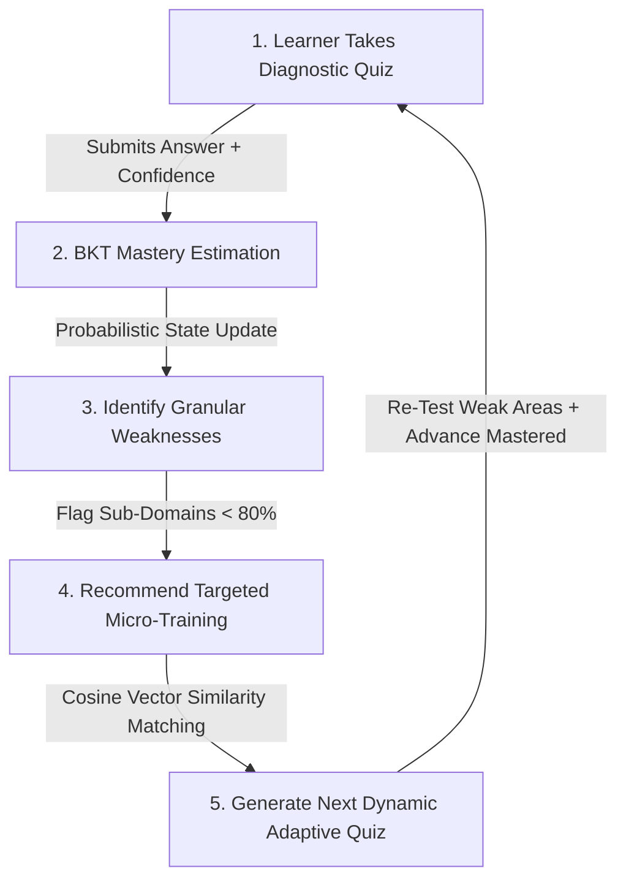
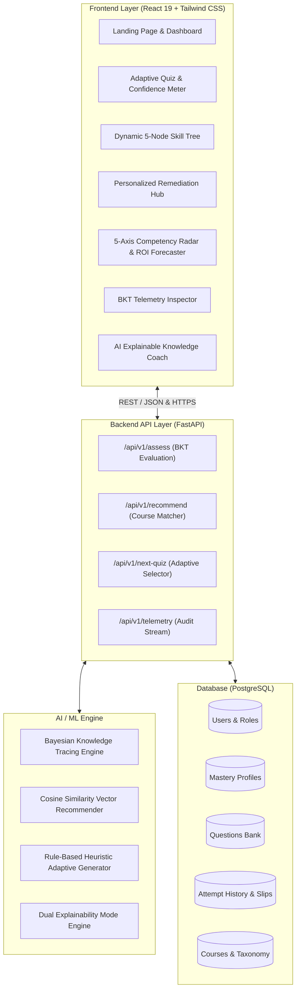

# 🛡️ AdaptIQ — Adaptive Cybersecurity Training Platform

## 📌 Executive Summary

Traditional corporate Learning Management Systems (LMS) force all employees through identical, static, and linear modules. This causes severe productivity loss for experienced staff and fails to remediate critical security knowledge gaps in vulnerable employees.

**AdaptIQ** is an end-to-end intelligent training platform that implements **Bayesian Knowledge Tracing (BKT)** to model learner mastery in real-time. By continuously evaluating diagnostic assessments, accounting for lucky guesses and careless slips, AdaptIQ provides personalized micro-learning modules and generates dynamic quizzes—creating a closed-loop adaptive learning system.

---

## 🔄 The 5-Step Continuous Adaptive Learning Loop



1. **Learner Takes Quiz:** The user attempts calibrated diagnostic scenario questions while providing a self-reported confidence level ($0 - 100\%$).
2. **BKT Mastery Estimation:** The Bayesian Knowledge Tracing engine calculates posterior probability of skill mastery $P(L_t | \text{Obs})$ per sub-domain using Bayes' theorem.
3. **Identify Weaknesses:** Sub-domains falling below the enterprise proficiency threshold ($<80\%$) are isolated.
4. **Recommend Training:** Personalized $10-18$ minute micro-courses are generated and prioritized via content-based cosine similarity.
5. **Generate Next Dynamic Quiz:** Synthesizes the next adaptive quiz cycle, re-testing previously failed concepts and skipping already-mastered modules to save time.

---

## 🧮 Mathematical Foundation: Bayesian Knowledge Tracing (BKT)

AdaptIQ models learner competency across 5 core IT security sub-domains:
- 🎣 **Phishing Awareness**
- 🔑 **Password Hygiene**
- 🎭 **Social Engineering & Pretexting**
- 📁 **Confidential Data Handling**
- 🚨 **Incident Reporting & SLA**

### Core BKT Parameters
| Parameter | Symbol | Description |
|---|---|---|
| **Prior Knowledge** | $P(L_0)$ | Initial probability that the learner possesses the skill |
| **Transition Rate** | $P(T)$ | Probability that a learner transitions from unmastered to mastered state per opportunity |
| **Slip Probability** | $P(S)$ | Probability that a learner knows the skill but makes a careless mistake |
| **Guess Probability** | $P(G)$ | Probability that a learner does not know the skill but guesses correctly |

### Updating Posterior Mastery

$$\text{If Correct:} \quad P(L_t \mid \text{Correct}) = \frac{P(L_{t-1}) \cdot (1 - P(S))}{P(L_{t-1}) \cdot (1 - P(S)) + (1 - P(L_{t-1})) \cdot P(G)}$$

$$\text{If Incorrect:} \quad P(L_t \mid \text{Incorrect}) = \frac{P(L_{t-1}) \cdot P(S)}{P(L_{t-1}) \cdot P(S) + (1 - P(L_{t-1})) \cdot (1 - P(G))}$$

$$\text{Next Opportunity Prior:} \quad P(L_{t+1}) = P(L_t \mid \text{Obs}) + (1 - P(L_t \mid \text{Obs})) \cdot P(T)$$

---

## 🏛️ System Architecture



---

## 🚀 Key Features

### 1. ⚡ Adaptive Assessment with Confidence Calibration
- Realistic multi-stage IT security scenarios.
- **Confidence Slider ($0 - 100\%$):** Differentiates high-confidence misconceptions from tentative guesses.
- **Instant BKT Delta Feedback:** Shows previous mastery $\rightarrow$ Bayes update $\rightarrow$ new score with live percentage change.
- **Dual Explainability Tabs:** Instant toggle between **👶 Simple (Non-Tech)** and **🛡️ Technical (Cybersec Spec)** insights.

### 2. 🗺️ Dynamic 5-Node Adaptive Skill Tree (Roadmap)
- Visual status indicators: **Mastered** ($\ge 80\%$), **Active In-Progress** ($50-79\%$), and **Needs Focus / Locked** ($<50\%$).
- Interactive node inspector with domain curriculum and direct launch links.
- **Simulate Remediation Jump:** One-click button demonstrating real-time mastery unlock with celebratory particle confetti.

### 3. 📚 Personalized Remediation Hub
- Dynamically filters courses matched to flagged weak sub-domains.
- Micro-learning cards with duration, platform tags, skills covered, and direct module launch.
- Interactive completion tracking that immediately feeds back into the BKT engine.

### 4. 📊 5-Axis Competency Radar & Enterprise ROI Forecaster
- **Radar Chart:** Visual comparison between current learner/team competency and target industry benchmarks.
- **Interactive ROI Sliders:** Adjust workforce cohort size ($5 - 500$ employees) and hourly wage ($\$15 - \$150/\text{hr}$) to calculate:
  - **Hours Saved:** Average $4.5\text{ hrs}$ saved per employee through adaptive skip-logic.
  - **Financial Savings:** Quantifiable dollar return on investment.
  - **Simulated Breach Risk Reduction:** $\sim 72\%$ reduction in phishing vulnerability.

### 5. ⚙️ Live Telemetry Drawer
- Floating inspector button accessible from any page.
- Displays real-time values of $P(L_0), P(T), P(S), P(G)$ per sub-domain.
- **Live Bayes Equation Breakdown:** Step-by-step arithmetic trace plugging live numbers into the formula.
- **Preset Scenarios:** Instant injector for *New Hire (Cold Start)*, *Developer Gap*, and *Mastered Champion*.

### 6. 🤖 AI Knowledge Coach (Explainable AI)
- Conversational tutor dialog answering threat concepts and mathematical queries.
- Instant suggested prompts on pretexting, FIDO2/WebAuthn, and incident containment.

---

## 📈 Impact & Business Value

```
                     AI-Driven Adaptive IT Training System (AdaptIQ)
                                          │
                        Personalized Learning Pathway
                   [Right Content • Right Difficulty • Right Time]
                                          │
       ┌──────────────────────────────────┼──────────────────────────────────┐
       ▼                                  ▼                                  ▼
Stronger IT Skills            Improved Learning Outcomes             Reduced Skill Gaps
• Focus on weak areas          • Better concept retention             • Early identification
• Practical knowledge growth   • Higher quiz performance              • Targeted practice
                                          │
                                          ▼
                                Better Job Readiness
               [Industry-Ready Workforce • Lower Breach Risk • High ROI]
```

- **Learner Impact:** Eliminates boring repetitive training; builds genuine competency.
- **Institutional Impact:** Automated, scalable evaluation with data-driven analytics.
- **Economic Impact:** Substantial productivity gains saving hundreds of working hours per cohort.

---

## 💻 Tech Stack

- **Frontend:** React 19, Tailwind CSS v4, Lucide React, Recharts
- **Build Tool:** Vite 8 (Ultra-fast HMR and bundle optimization)
- **Backend Spec:** Python 3.11, FastAPI, Pydantic, REST/JSON
- **Database Spec:** PostgreSQL 16 (Neon Cloud)
- **AI/ML:** NumPy, pandas, Bayesian Knowledge Tracing (BKT), Scikit-Learn (Cosine Similarity)

---

## 🛠️ Local Installation & Run Guide

```bash
# 1. Clone the repository
git clone https://github.com/ShreyanshiChourasia/cybersecurity-training.git

# 2. Navigate to project root
cd cybersecurity-training

# 3. Install dependencies
npm install

# 4. Start the local development server
npm run dev

# 5. Open in browser
# Navigate to http://localhost:5173
```

---

## 🧑‍⚖️ Quick Demo Guide

1. **Dashboard:** Explore the Analytics Dashboard with **5-Axis Competency Radar** and **ROI Forecaster**.
2. **Adaptive Quiz:** Pick Question 1, move the **Confidence Slider** to $80\%$, submit answer, and observe the live BKT delta banner and dual explanation tabs.
3. **Data Drawer:** Click **Raw Data View** in the top right to verify live parameters.
4. **Skill Tree:** Switch to the **Skill Tree** tab and click **"Simulate Remediation Jump"** to see live node unlocking.
5. **Remediation Hub:** Open **Remediation Hub**, check off a course, and observe the progress bar advance while boosting domain mastery.
6. **ROI & Radar:** Adjust the workforce sliders on the Dashboard to see real-time calculation of employee hours and financial savings.
7. **AI Coach:** Click **🤖 AI Coach** to test explainable AI answers on cybersecurity attack vectors.
